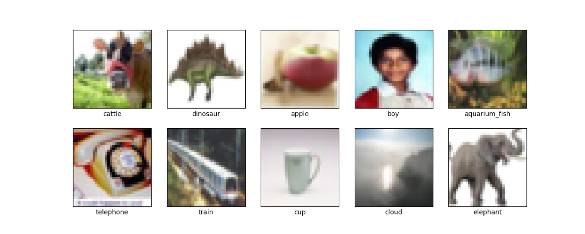

# Image Classification Project

## Overview

This project is a Convolutional Neural Network (CNN) based image classification system implemented in PyTorch. It is designed to classify images from the CIFAR-100 dataset, which consists of 100 classes containing 600 images each. The network architecture is defined in a single Python script, which includes data loading, preprocessing, model definition, training, and evaluation.

## Model Architecture

The CNN model is composed of three convolutional layers, each followed by max-pooling layers, and two fully connected layers at the end. The model's architecture is defined in a class `CNN` which extends `nn.Module` from PyTorch.

## Dataset

The CIFAR-100 dataset is used in this project. It is automatically downloaded and preprocessed by the script. The data loader applies necessary transformations and prepares the data for training. 

Below are some example images from the CIFAR-100 dataset with their corresponding labels:

## Usage

1. Clone this repository.
2. Install the dependencies: `pip install -r requirements.txt`.
3. Run `python image_classifier.py`.

## Requirements

To run this project, you will need the following packages:

- datasets
- torch
- torchvision
- matplotlib
- scikit-learn
- tqdm

## Results

Our CNN model, trained for 10 epochs, achieves the following accuracy on the CIFAR-100 test dataset:

- Fine labels accuracy: 40.81%
- Coarse labels accuracy: 52.16%